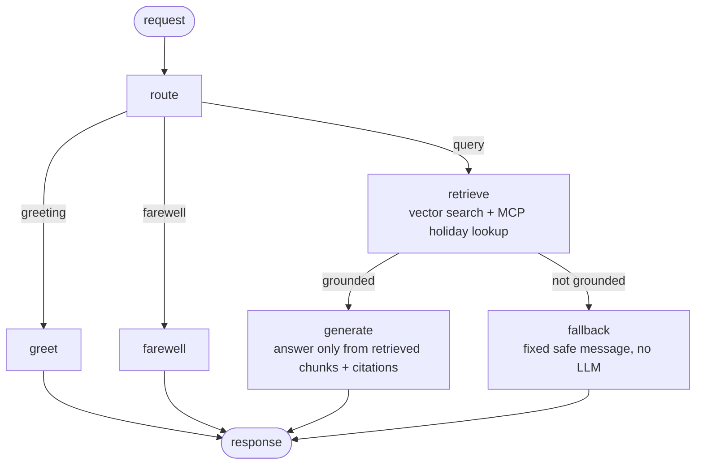

# 🌸 Blossom Banking AI Agent

[](https://github.com/CamiloC0rtes/banking-support-rag-agent/actions/workflows/ci.yml)

A RAG support agent for a (fictional) bank's login and security questions — passwords, MFA, trusted devices and account recovery. Every policy answer is grounded in the bank's PDF documentation and cited; when the documentation doesn't cover a question, the agent says so instead of guessing.

**Stack:** FastAPI · LangGraph · ChromaDB · OpenAI · MCP (federal-holiday tool) · Docker · GitHub Actions

---

## 🏗 Architecture

The agent is an explicit LangGraph state machine. Each node has one job and its latency is reported per request.



| Node | What it does |
|---|---|
| `route` | Detects pure greetings/farewells (a greeting followed by a real question is *not* small talk) and resolves follow-ups like "give me the steps" to the previous question. |
| `retrieve` | Top-k similarity search with relevance scores, in parallel with the MCP holiday lookup. Marks the question in scope if it matches a security term **or** the best chunk clears `RELEVANCE_THRESHOLD`. |
| `generate` | Answers strictly from the retrieved chunks, admits gaps, cites every source page used. |
| `fallback` | Fixed template. The LLM is never asked to improvise when there is no grounding. |

## 🛡 Hallucination fixes (v2)

The first version scored well on latency but the post-deploy log ([`docs/baseline_postdeploy_metrics.json`](docs/baseline_postdeploy_metrics.json)) showed ungrounded answers:

- **3 of 10 answers had no source.** Scope was decided by exact keywords, so "remember **this** device" and "**codes**" didn't match and went to an out-of-scope path that called the LLM *without context and without forbidding an answer*. Result: "remember this device lasts until you clear your cookies" — the policy says **30 days**.
- **Cited answers still invented steps** (a "Forgot Password" link, backup codes, reinstalling the app) that are not in the documentation.
- `/chat/stream` bypassed the agent entirely (no retrieval).

v2 replaces keyword-only scoping with relevance scores + stemmed patterns, makes the no-grounding path a fixed message, tightens the generation prompt, routes streaming through the same graph, and adds the evaluation below so regressions are caught.

## 📏 Evaluation

`tests/eval/` contains a golden set of 16 questions built from the policy PDF, each labeled with the expected behavior:

- **answer** — must include the documented facts (e.g. `30 days`, `60 seconds`) and cite sources
- **gap** — in scope but not covered by the docs: must admit it, and must not repeat known hallucinations
- **fallback** — off topic: must return the safe fallback

Every non-fallback answer is also checked by an **LLM judge** that lists claims not supported by the retrieved chunks. The report includes p95 latency and the top retrieval score per question (used to calibrate `RELEVANCE_THRESHOLD`).

```bash
python -m tests.eval.run_eval --min-pass 0.9   # writes eval_report.md / .json
```

It also runs on demand in GitHub Actions (**Actions → Faithfulness eval**, needs an `OPENAI_API_KEY` secret) and publishes the report as the job summary.

## 🧪 Tests

```bash
pip install -r requirements-dev.txt
pytest                     # 44 unit tests, LLM / vector store / MCP mocked — runs in CI on every push
pytest -m integration      # live API + SLA tests against a running server
```

Unit tests cover routing (including regressions for the misrouted questions), the grounding gate, fallback without LLM calls, follow-up resolution, graceful degradation when retrieval fails, and the eval's own scoring.

---

## ⚙️ Configuration

| Variable | Description | Default |
|---|---|---|
| `OPENAI_API_KEY` | OpenAI API key (**required**) | — |
| `CHAT_MODEL_NAME` | Answer model | `gpt-4o-mini` |
| `EMBEDDING_MODEL_NAME` | Embedding model | `text-embedding-3-small` |
| `JUDGE_MODEL_NAME` | Eval judge model | `gpt-4o-mini` |
| `CHROMA_PATH` | ChromaDB persistence path | `./chroma_db` (`/app/chroma_db` in Docker) |
| `DATA_PATH` | PDF knowledge base directory | `./data` |
| `RETRIEVAL_K` | Chunks retrieved per question | `4` |
| `RELEVANCE_THRESHOLD` | Min relevance for questions without security keywords (calibrated with the eval: off-topic ≤ 0.00, answerable 0.08–0.39) | `0.15` |

## 🔌 API

| Endpoint | Method | Description |
|---|---|---|
| `/chat` | POST | Full response with `answer`, `sources`, `grounded` and per-node `node_latency_ms` |
| `/chat/stream` | GET | Server-Sent Events: same graph, streamed tokens, then sources |
| `/health` | GET | Liveness/readiness, MCP status |

Every response carries `X-Process-Time-Ms` and `X-SLA-Status` (`MET` under 5 s) headers.

## 🗂 Knowledge base

Only whitelisted PDFs in `data/` are ingested. Chunks carry source filename, page number and topic tags, which drive the citations. Holiday awareness comes from an MCP server wrapping a public federal-holiday API, so answers about manual reviews account for weekends and holidays.

## 💻 Running it

```bash
cp .env.example .env        # add your OPENAI_API_KEY
pip install -r requirements.txt
python scripts/ingest.py
uvicorn src.main:app --reload --port 8000
```

Docker:

```bash
docker compose up --build
```

The container runs as a non-root user with ChromaDB on a mounted volume, a lazy vector-store initialization and a warm-up call to avoid cold-start latency.

## 🛠 Troubleshooting

| Symptom | Cause | Resolution |
|---|---|---|
| `ChromaDB (code: 14)` | Permissions or volume | Check the `chroma_db` volume mount and container user |
| `mcp_ready: false` | MCP server failed | Check logs; the agent still answers, without holiday awareness |
| Too many fallbacks | Threshold too strict | Lower `RELEVANCE_THRESHOLD` using the eval's top-score column |
| `401 Unauthorized` | Invalid API key | Verify `OPENAI_API_KEY` |
